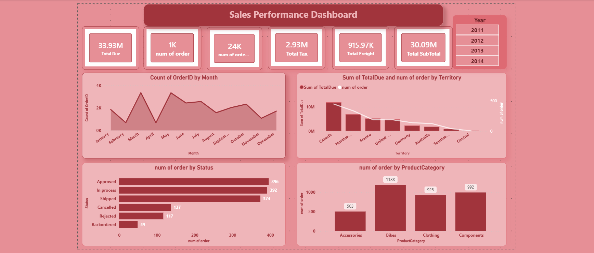

# Data-Analysis
A collection of data analysis projects using Excel, SQL, Power BI, Python to uncover insights and support data-driven business decisions. 

**Sales Performance Dashboard** 
[View Power BI Dashboard](https://drive.google.com/file/d/1YaZT9cgGSyglPQaOPZmQ6xdUn3-VNhIt/view?usp=sharing)

**Tools** Power BI - DAX - Power Query  

**KPIs** 
-Total Due 
-Total Subtotal 
-Total Tax
-Total Freight 
-Num of Orders
-Num of Order Details

**Interactive Tooltip** 
-Num of orders 
-Total Due 
-Total Subtotal by Product Category 

